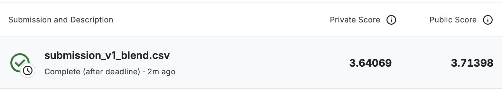

# Прогнозирование лояльности клиентов по данным транзакций

Проект выполнен на данных соревнования **Elo Merchant Category Recommendation**.

Цель — построить модель регрессии, которая по характеристикам карты и истории транзакций прогнозирует показатель лояльности клиента `target`.

Метрика качества — RMSE.

## Данные

В работе использованы следующие таблицы:

- `train.csv` — 201 917 карт с целевой переменной
- `test.csv` — 123 623 карты без целевой переменной
- `historical_transactions.csv` — исторические транзакции
- `new_merchant_transactions.csv` — транзакции нового периода
- `merchants.csv` — характеристики продавцов
- `sample_submission.csv` — шаблон submission

Одна строка в `train.csv` и `test.csv` соответствует одной карте. Транзакционные таблицы содержат несколько операций на карту, поэтому перед моделированием данные агрегировались до уровня `card_id`.

Исходные данные не добавлены в репозиторий из-за большого объёма.

## Что сделано

В ноутбуке выполнены:

- первичный осмотр и EDA
- проверка пропусков, дубликатов, специальных и экстремальных значений
- разделение обучающей выборки на рабочую и отложенную части
- обработка больших транзакционных таблиц с помощью DuckDB
- сохранение промежуточных таблиц в Parquet
- подготовка таблицы продавцов с одной строкой на `merchant_id`
- создание 65 признаков на уровне карты
- трёхфолдовая стратифицированная кросс-валидация
- сравнение DummyRegressor, ElasticNet, HistGradientBoostingRegressor и LightGBMRegressor
- ограниченный подбор параметров LightGBM
- построение ансамбля двух лучших моделей
- финальная проверка на отложенной выборке
- формирование submission для Kaggle

## Результаты моделей

Все модели сравнивались на одинаковых кросс-валидационных фолдах

| Модель | OOF RMSE |
|---|---:|
| DummyRegressor | 3,84887 |
| ElasticNet | 3,84683 |
| HistGradientBoostingRegressor | 3,67151 |
| LightGBMRegressor | 3,66474 |
| LightGBMRegressor с регуляризацией | 3,66286 |
| Ансамбль LightGBM и HistGradientBoostingRegressor | **3,66240** |

Лучший результат показал ансамбль двух моделей:

- LightGBMRegressor — вес `0,816`
- HistGradientBoostingRegressor — вес `0,184`

## Итоговая модель

Результаты финального ансамбля:

| Оценка | RMSE |
|---|---:|
| OOF | 3,66240 |
| Holdout | 3,71277 |
| Public Score | 3,71398 |
| Private Score | 3,64069 |

На отложенной выборке порядок моделей сохранился. Holdout RMSE практически совпал с Public Score.



## Особенности решения

Целевая переменная имеет длинный левый хвост. Значение `-33,219281` встречается примерно у 1,09% карт, поэтому эта группа отдельно учитывалась при формировании выборок и CV-фолдов.

Для карт были созданы следующие группы признаков:

- исходные признаки карты
- календарные признаки первой активности
- количество транзакций и активных дней
- денежные агрегаты
- длительность и давность активности
- авторизация и рассрочка
- разнообразие продавцов и категорий
- наличие новых транзакций
- различия и отношения между историческим и новым периодами

Параметры предобработки рассчитывались отдельно внутри каждого фолда.

## Ограничения

В исторических данных есть одна операция около 6 млн, которая сильно влияет на денежные агрегаты.

Преимущество ансамбля над отдельной моделью LightGBM небольшое, поэтому усложнение решения даёт ограниченный прирост качества.

## Возможные направления улучшения

- добавить устойчивые денежные признаки: медианы, квантили и логарифмические преобразования
- расширить агрегацию характеристик продавцов
- проверить вклад разных групп признаков
- провести более широкий подбор параметров LightGBM
- проверить другие способы объединения прогнозов моделей

## Структура репозитория

```text
elo-merchant-recommendation/
├── images/
│   └── kaggle_result.png
├── submissions/
│   └── submission_final.csv
├── .gitignore
├── elo_merchant_recommendation.ipynb
├── README.md
└── requirements.txt
```

Папки `data/`, `cache/` и `.venv/` используются локально и не добавляются в Git.

## Запуск

Основной ноутбук:

[elo_merchant_recommendation.ipynb](elo_merchant_recommendation.ipynb)

Для запуска нужно скачать данные соревнования и поместить файлы в папку `data/`:

```text
data/
├── train.csv
├── test.csv
├── sample_submission.csv
├── historical_transactions.csv
├── new_merchant_transactions.csv
└── merchants.csv
```

Создать и активировать виртуальное окружение:

```bash
python3 -m venv .venv
source .venv/bin/activate
```

Установить зависимости:

```bash
pip install -r requirements.txt
```

После этого открыть ноутбук и выполнить ячейки сверху вниз.

При первом запуске будет создан локальный Parquet-кэш в папке `cache/`. Финальный файл сохраняется в:

```text
submissions/submission_final.csv
```
